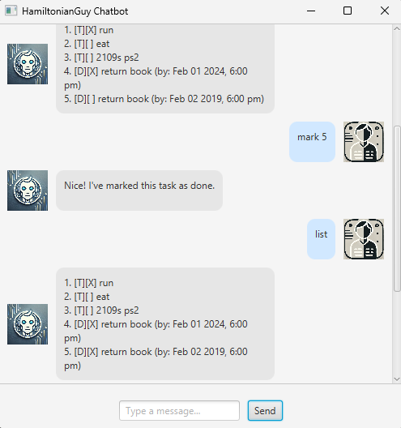

# **📖 HamiltonianGuy**

Welcome to **HamiltonianGuy**, your chatbot that helps you manage tasks efficiently!



## **📌 Features**

1. **Adding a Task**
    - `todo <task_description>` – Adds a simple task to the list.
    - `deadline <task_description> /by <yyyy-MM-dd HHmm>` – Adds a task with a deadline.
    - `event <task_description> /from <yyyy-MM-dd HHmm> /to <yyyy-MM-dd HHmm>` – Adds an event with a start and end time.

2. **Viewing Tasks**
    - `list` – Displays all tasks in the list.

3. **Marking Tasks as Done/Not Done**
    - `mark <task_number>` – Marks a task as done.
    - `unmark <task_number>` – Marks a task as not done.

4. **Deleting a Task**
    - `delete <task_number>` – Removes a task from the list.

5. **Finding Tasks**
    - `find <keyword>` – Searches for tasks containing the keyword.

6. **Sorting Tasks**
    - `sort` – Sorts tasks based on their deadlines.


## **💡 How to Use HamiltonianGuy**
### **🔹 Step 1: Run the Application**
1. **Download the JAR file** from the releases page.
2. Open a **terminal/command prompt** and navigate to the directory containing the JAR file.
3. Run the following command:
   ```sh
   java -jar HamiltonianGuy.jar
   ```
4. The chatbot interface should open, displaying a **welcome message**.

### **🔹 Step 2: Start Adding Tasks**
- Type any command (e.g., `todo Buy groceries`) and press **Enter**.
- The chatbot will respond with a confirmation message.

### **🔹 Step 3: Manage Your Tasks**
- Use the commands listed above to **mark, delete, sort, and find tasks**.

### **🔹 Step 4: Exit the Chatbot**
- Type `bye` to close the application.

---

## **🔧 Setup Guide for Developers**
### **🛠️ Prerequisites**
- **Java 17** or later must be installed.
- Ensure you have **Gradle** installed.

### **🚀 Building the Project**
1. Clone the repository:
   ```sh
   git clone https://github.com/your-username/HamiltonianGuy.git
   cd HamiltonianGuy
   ```
2. Build the project:
   ```sh
   ./gradlew build
   ```
3. Run the application:
   ```sh
   ./gradlew run
   ```

---

## **🎨 Example Usage**
**Input:**
```sh
todo Buy milk
deadline Submit assignment /by 2024-03-01 2359
event Birthday party /from 2024-03-10 1800 /to 2024-03-10 2200
```

**Output:**
```
Got it. I've added this task:
[T][ ] Buy milk
[D][ ] Submit assignment (by: Mar 01 2024, 11:59 PM)
[E][ ] Birthday party (from: Mar 10 2024, 6:00 PM to Mar 10 2024, 10:00 PM)
```

---

## **📩 FAQ**
### **🔹 Where is my data stored?**
Your task list is saved in `data/HamiltonianGuy.txt` and is loaded each time you run the application.

### **🔹 How do I delete all tasks at once?**
Currently, there is no **clear all** command. You can manually delete the `data/HamiltonianGuy.txt` file.

---


---
